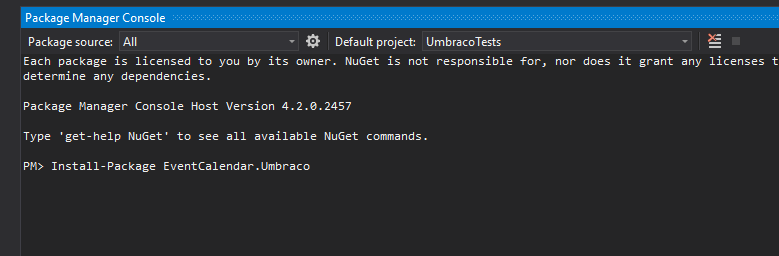
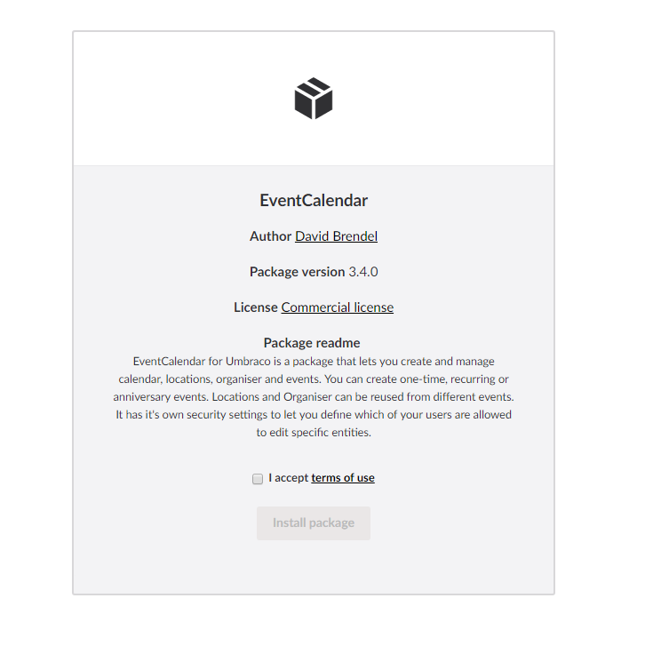
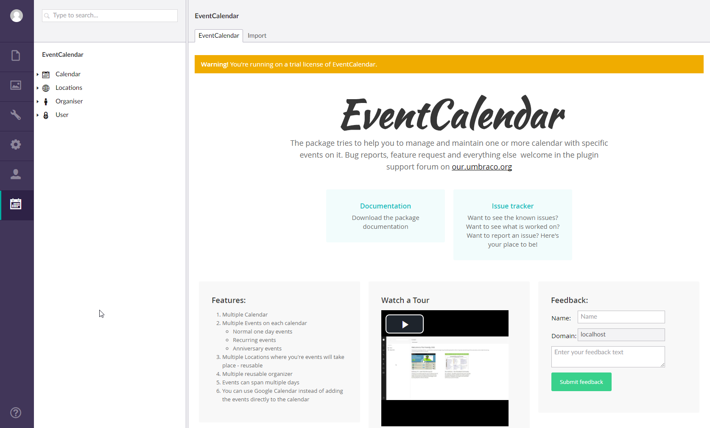

# Installation

It is possible to install the package through Nuget or as an Umbraco package.

Type: `install-package EventCalendar.Umbraco` in your Visual Studio NuGet Package Manager.

The other way is to use the normal Umbraco Package install method with the download found here: https://our.umbraco.org/projects/backoffice-extensions/eventcalendar/

If you just want to work with the api then also have a look at the core library:

Type: `install-package EventCalendar.Core` in your Visual Studio NuGet Package Manager.

https://www.nuget.org/packages/EventCalendar.Core/

## Global configuration

The package contains a configuration file for global configuration settings. It is located under App_Plugins/EventCalendar/DefaultConfiguration.json.

It contains settings that are reused on backend and frontend of the package.

It looks like this:
{
	"GoogleMapsApiKey": "",
	"DefaultMapLocation": {
		"Latitude": 40.782865,
		"Longitude": -73.965355
	}
}

__*Current settings:*__
* GoogleMapsApiKey - used for setting the api key to use google maps features of the package.
* DefaultMapLocation - used to set the default map location for setting the location on locations/organiser.

## Document Types

The package comes with some document types which can be used to setup calendar and detail pages quickly.

__ECCalendar:__ Used to show a calendar on the website. Has a property to select a specific calendar or show all.

__ECEventDetails:__ Used to show details of an event.

__ECLocationDetails:__ Used to show details for a location.

__ECOrganiserDetails:__ Used to show details for organiser

The default document types are using a custom route for displaying details for events, locations and organiser. These routes are generated for each node type of the detail nodes present in the content tree. They are build by using the url of the detail node, the name of the event/location/organiser and it's id.

## Macros

There are different macros in the package that can be used to display different information.

* EventCalendar.LatestEvents
* EventCalendar.LatestEventsForCalendar
* EventCalendar.UpcomingEvents
* EventCalendar.UpcomingEventsForCalendar
* EventCalendar.OrganiserDetails
* EventCalendar.Calendar
* EventCalendar.LocationDetails
* EventCalendar.EventDetails

## EventCalendar section
This package provides its own custom section where calendar, events, locations and organiser can be created and edited.

The section consists of the corresponding tree where you can find the created entities and the dashboards.