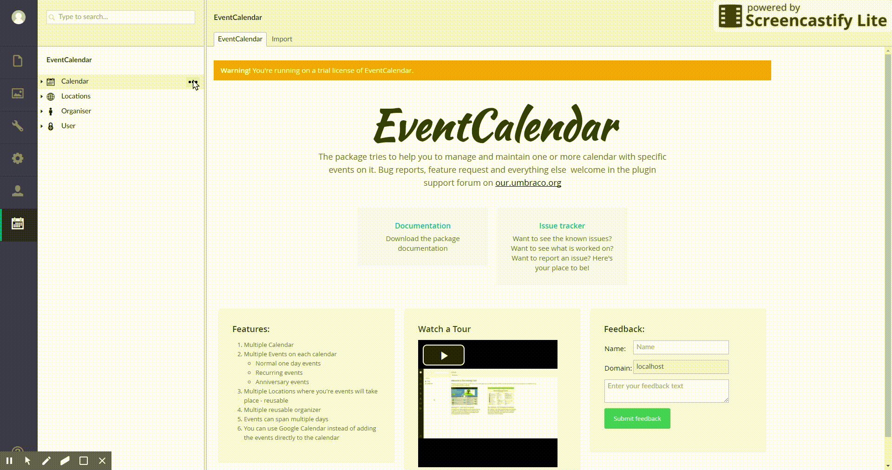
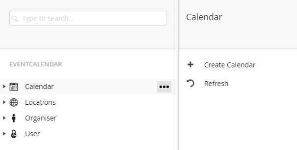
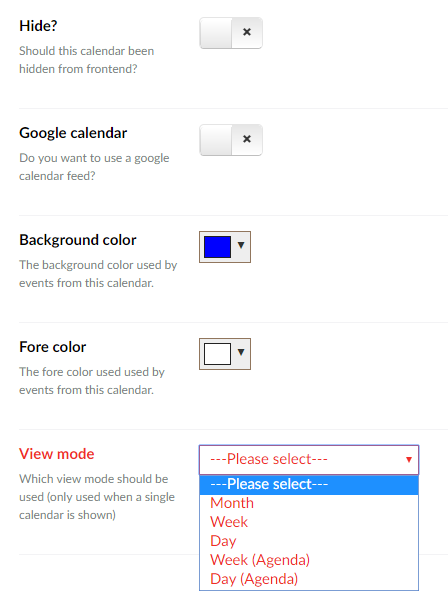
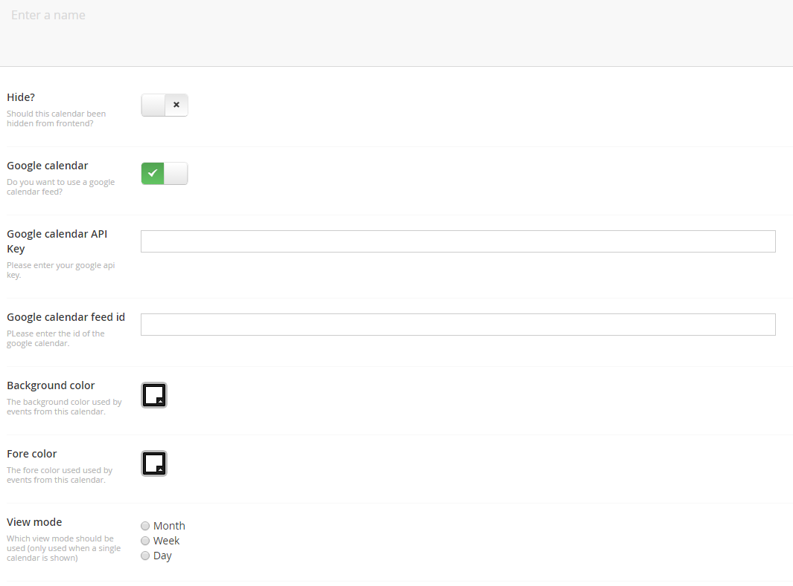
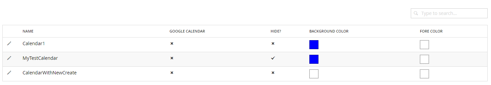
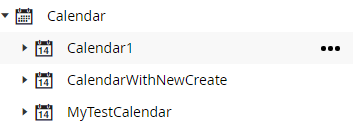
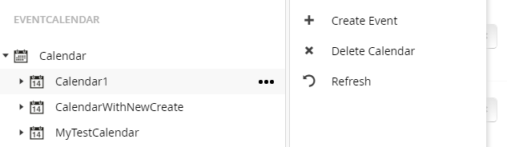

# Calendar handling

The package lets you manage different calendar. Each calendar can contain unlimited events.
Also it is possible to use a calendar to get events from google calendar.

## Creating calendar
For creating a new calendar click on the well known icon besides the calendar node in the tree.

After clicking on the menu item the calendar creation screen will be shown.
Here all necessary information for a calendar can be entered.

The following fields are available for editing:

* *Name*
The name of this calendar

* *Hide?*
Should the calendar been hidden on frontend. Only useful when all calendar are shown on frontend.

* *Google calendar*
This option indicates that the calendar should fetch events from google calendar.

* *Background color*
Set the backgorund color that is used on frontend for events related to this calendar

* *Forecolor*
Set the forecolor that is used on frontend for events related to this calendar

* *View mode*
Which view mode should be used for this calendar when it is shown as the only calendar on frontend

When activating the calendar for usage with google calendar two additional fields will appear.

* *Google calendar api key*
This is the api key which is needed for access to google calendar

* *Google calendar feed id*
The feed id of the calendar which should be used

When all fields are entered you can save the calendar.

## Editing calendar
For editing a calendar expand the calendar node and select the calendar which you want to edit or select it from the list view when selecting the calendar node.

List view:

From the list view click on the calendar name to get to the edit screen.

Tree view:

From the tree view click on a calendar to get to the edit screen.

On the edit screen the same fields are shown as during creation of the calendar.

## Deleting calendar
For deleting a calendar right click on the calendar or use the known menu button.

