# Event handling

The package knows three different types of events:
* Normal events
Used for one time events
* Recurring events
Used for events which occurs for example every wednesday
* Anniversary events
Used for birthdays or similar

Each calendar can have an unlimited number of events of each type.
For creation of events use the menu besides a created calendar. In the dialog which appears you can select one of the three event types descripted above.

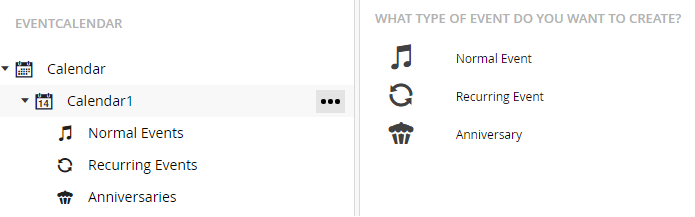

## Normal Events
Normal events are used for one time events.

### Creating events
After selecting a normal event in the dialog the event creation screen will be shown.
Here all necessary information for an event can be entered.

The screen is separated into three dashboards:
* __General__
Here general event information can be entered like the date/time the event occurs, if it’s an all day event and which location/organiser is related to the event.
* __Media__
Media files related to that event can be selected here.
* __Descriptions__
Here the descriptions for this event can be entered

__General dashboard__

The following fields are available for editing:

* __Name__
The name of the event
* __Icon__
A custom icon for this event used in the list view in overview pages
* __Startdate / -time__
The startdate and the starting time of the event
* __Enddate / -time__
The enddate and the ending time of the 
* __All day__
If an event should be an all day event
* __Location__
The location where the event takes place
* __Organiser__
The organiser of the event
* __Categories__
With this categories can be set which are used for filtering in frontend

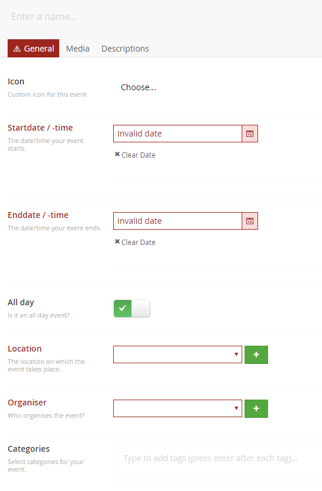

__Media dashboard__

The media dashboard can be used to select images for displaying on the event detail page. The media dashboard reuses the media library of Umbraco so you can upload/select images from the media section.

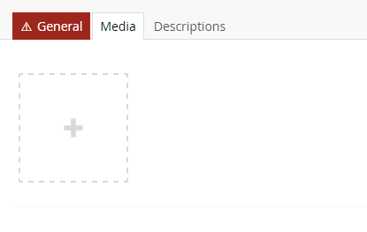

__Descriptions dashboard__

For each configured language in Umbraco a description can be saved for the location. To show some information on the details page. The descriptions are edited with the grid editor.

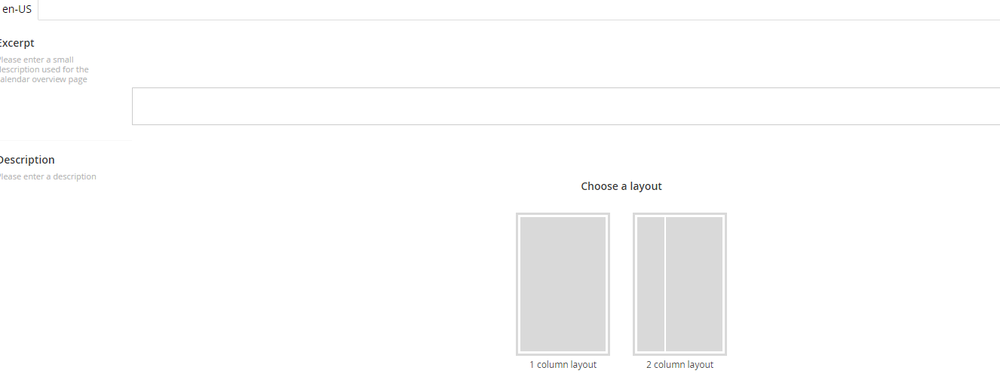

## Recurring Events

### Creating events
After selecting a recurring event in the dialog the event creation screen will be shown.
Here all necessary information for an event can be entered.

The screen is separated into five dashboards:
* __General__
Here general event information can be entered like the date/time the event occurs, if it’s an all day event and which location/organiser is related to the event.
* __Media__
Media files related to that event can be selected here.
* __Descriptions__
Here the descriptions for this event can be entered.
* __Recurrence pattern__
Select how the event will occur. Monthly, daily, weekly,...
* __Exception dates__
Sometime some dates are special and the event shouldn’t take place on these like for holidays. This can be added here.

__General dashboard__

The following fields are available for editing:

* __Name__
The name of the event
* __Icon__
A custom icon for this event used in the list view in overview pages
* __Startdate / -time__
The startdate and the starting time of the event
* __Enddate / -time__
The enddate and the ending time of the 
* __All day__
If an event should be an all day event
* __Location__
The location where the event takes place
* __Organiser__
The organiser of the event
* __Categories__
With this categories can be set which are used for filtering in frontend

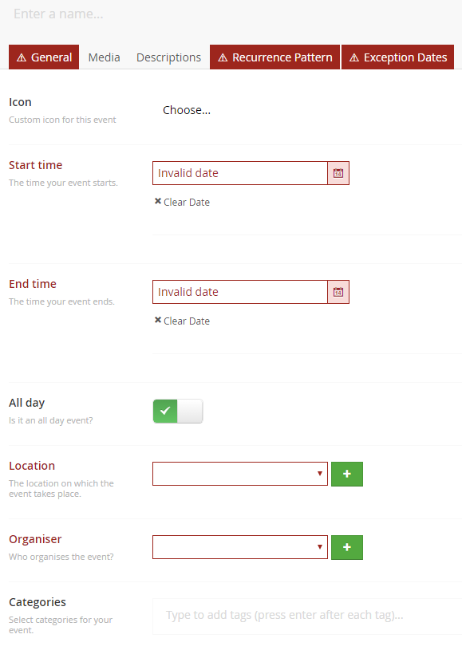

__Media dashboard__

The media dashboard can be used to select images for displaying on the event detail page. The media dashboard reuses the media library of Umbraco so you can upload/select images from the media section.

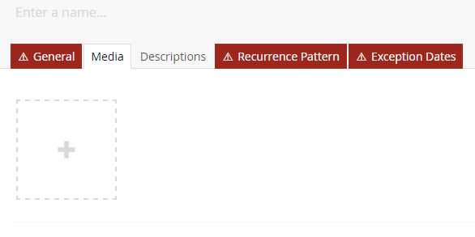

__Descriptions dashboard__

For each configured language in Umbraco a description can be saved for the event. To show some information on the details page. The descriptions are edited with the grid editor.

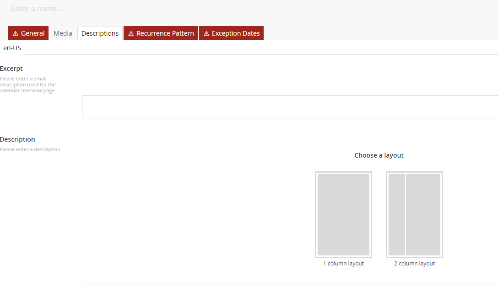

__Pattern dashboard__

For recurring events the days on which it occurs can set, the frequency (daily, monthly,...) and the monthly range it occurs.

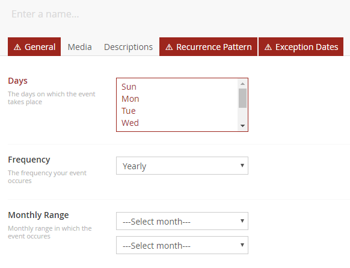

__Exceptions dashboard__

Here exception dates can be set on which the event doesn’t takes place. For a holiday as an example.

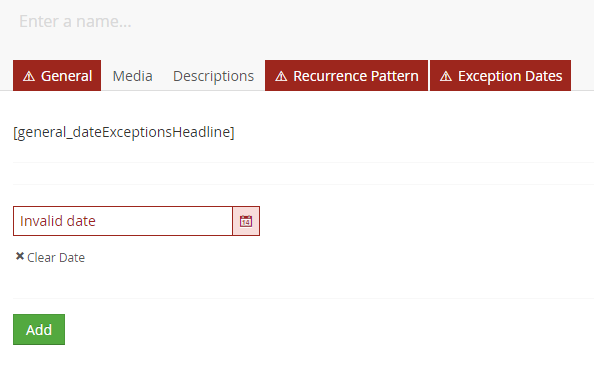

## Anniversary Events

### Creating events
After selecting an anniversary event in the dialog the event creation screen will be shown.
Here all necessary information for an event can be entered.

The screen is separated into three dashboards:
* __General__
Here general event information can be entered like the date/time the event occurs, if it’s an all day event and which location/organiser is related to the event.
* __Media__
Media files related to that event can be selected here.
* __Descriptions__
Here the descriptions for this event can be entered.
* __Anniversary pattern__
This is the pattern the event uses to set when it occurs.

__General dashboard__
The following fields are available for editing:

* __Name__
The name of the event
* __Icon__
A custom icon for this event used in the list view in overview pages
* __Location__
The location where the event takes place
* __Organiser__
The organiser of the event
* __Categories__
With this categories can be set which are used for filtering in frontend

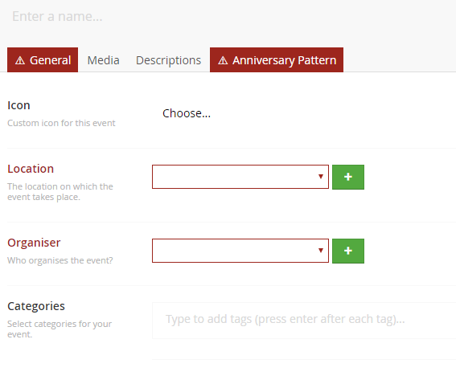

__Media dashboard__

The media dashboard can be used to select images for displaying on the event detail page.

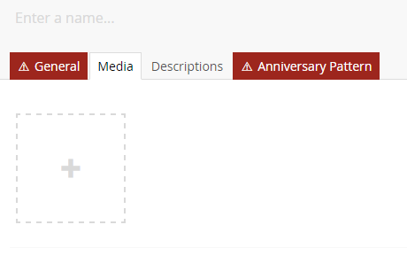

__Descriptions dashboard__

For each configured language in Umbraco a description can be saved for the event. To show some information on the details page. The descriptions are edited with the grid editor.

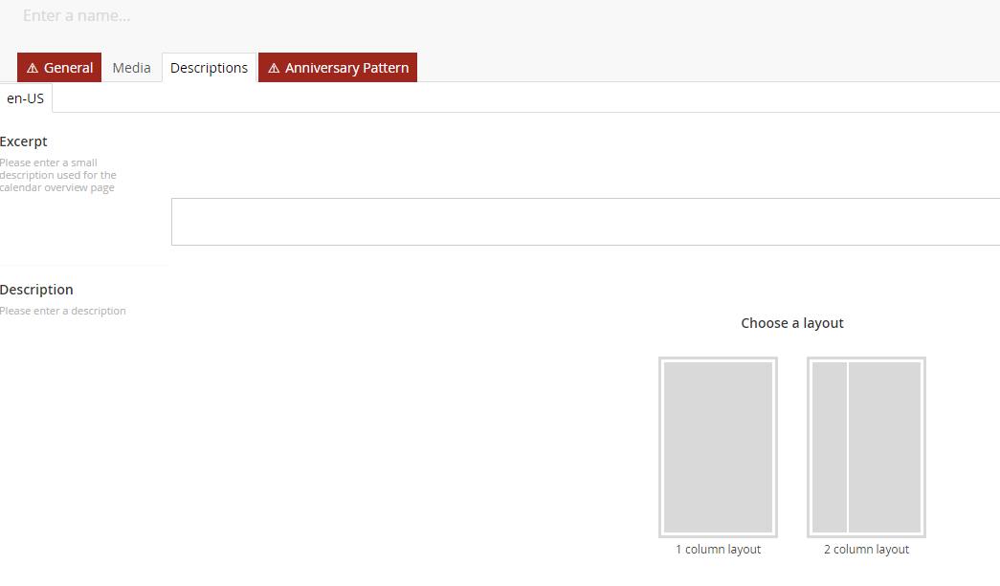

__Pattern dashboard__

For an anniversary the month and the day can be set. The event then occurs each year on the same date.

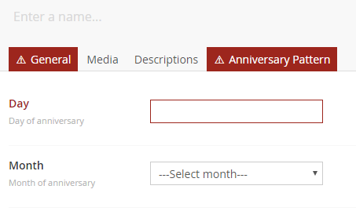

## Editing events
For editing an event expand the calendar node and select the corresponding event type. In the list view click on the event name to get to the edit screen.

__Normal events:__

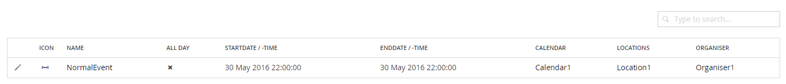

__Recurring events:__

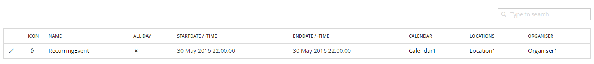

__Anniversary events:__

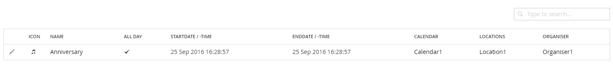

On the edit screen the same fields are shown as during creation of an event.

## Deleting events
For deleting an event select it on the overview page and then press the delete button.

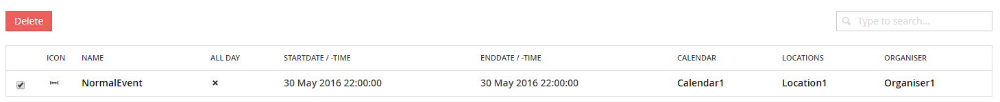