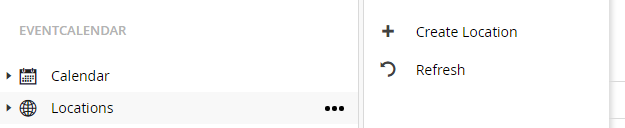
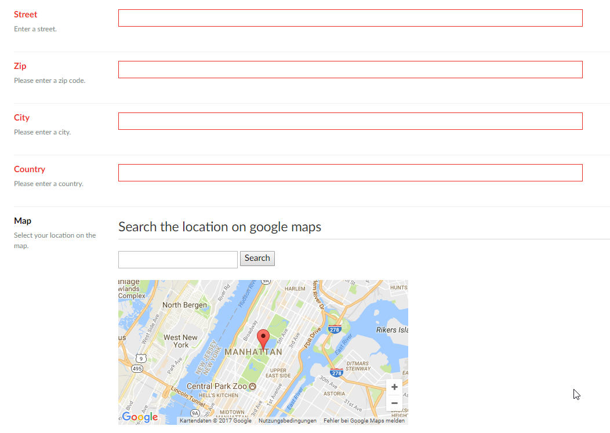
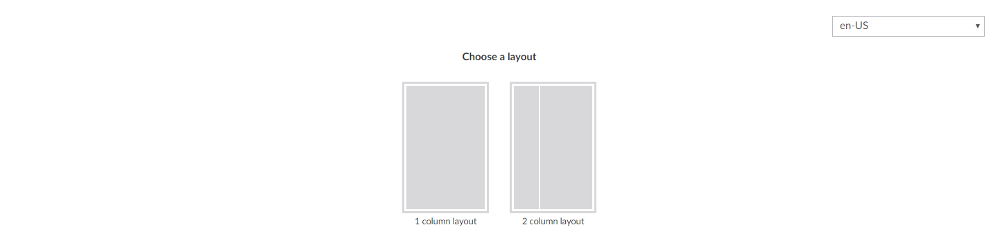
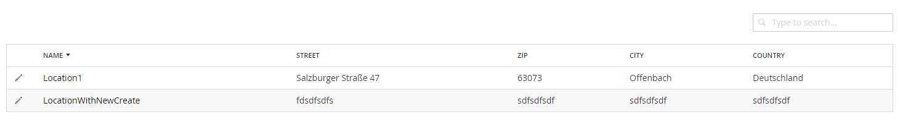
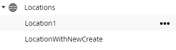
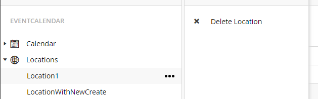

# Handling Locations
The package lets you manage different locations. Each location can be used by/for multiple events.

## Create locations
For creating a new calendar click on the well known icon besides the calendar node in the tree.

After clicking on the menu item the calendar creation screen will be shown.
Here all necessary information for an organiser can be entered.

The creation screen has 3 different dashboards:

* __*General*__

For all general information for a location
* __*Descriptions*__

The place where descriptions for this location can be created. They are shown on the frontpage in the location details view

* __*Events*__

Here are the events shown for which the location is selected

#### General
In the general dashboard you can set address information for the location. Also the location can be searched on google maps to display it on frontend.

#### Descriptions
For each configured language in Umbraco a description can be saved for the location. So you can show some information on the details page. The descriptions are edited with the grid editor.

The package provides a custom data type based on the grid data type called __*“EventCalendar Grid”*__. The settings of the grid can be changed to reflect the different needs.

#### Events
The events dashboard just shows related events in a listview. 

## Edit locations
For editing an organiser expand the organiser node and select the organiser which you want to edit or select it from the list view when selecting the organiser node.

__List view:__

From the list view click on the organiser name to get to the edit screen.

__Tree view:__

From the tree view click on a organiser to get to the edit screen.

On the edit screen the same fields are shown as during creation of an organiser.

## Delete locations
For deleting an organiser right click on the organiser or use the known menu button.

