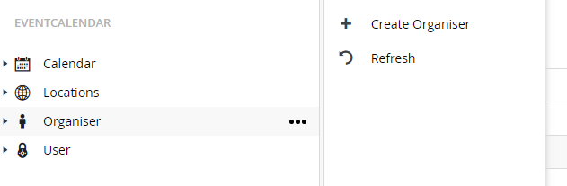
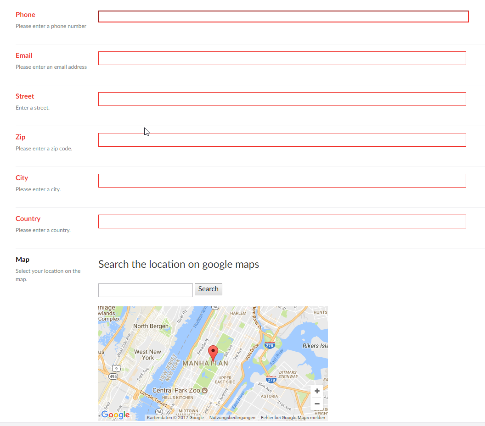
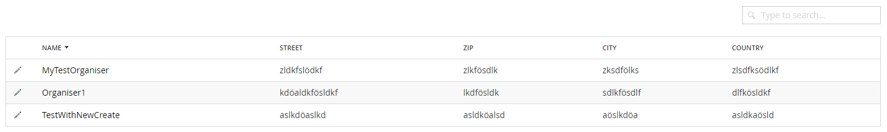
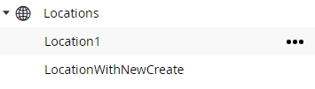
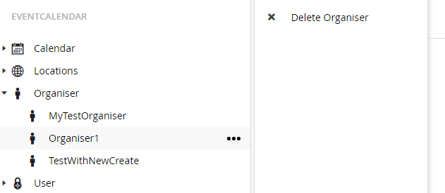

# Handling Organiser
The package lets you manage different organiser. Each organiser can be used by/for multiple events.

## Create organiser
For creating a new calendar click on the well known icon besides the calendar node in the tree.

After clicking on the menu item the calendar creation screen will be shown.
Here all necessary information for an organiser can be entered.

The creation screen has 3 different dashboards:

* _General_

For all general information for an organiser

* _Descriptions_

The place where descriptions for this organiser can be created. They are shown on the frontpage in the organiser details view

* _Events_

Here are the events shown for which the organiser is selected

#### General
In the general dashboard you can set address information for the organiser. Also the location can be searched on google maps to display it on frontend.

#### Descriptions
For each configured language in Umbraco a description can be saved for the organiser. So you can show some information on the details page. The descriptions are edited with the grid editor.

The package provides a custom data type based on the grid data type called “EventCalendar Grid”. The settings of the grid can be changed to reflect the different needs.

#### Events
The events dashboard just shows related events in a listview. 

## Edit organiser
For editing an organiser expand the organiser node and select the organiser which you want to edit or select it from the list view when selecting the organiser node.

__List view:__

From the list view click on the organiser name to get to the edit screen.

__Tree view:__

From the tree view click on a organiser to get to the edit screen.

On the edit screen the same fields are shown as during creation of an organiser.

## Delete organiser
For deleting an organiser right click on the organiser or use the known menu button.

