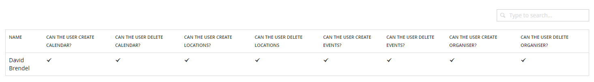
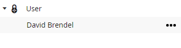
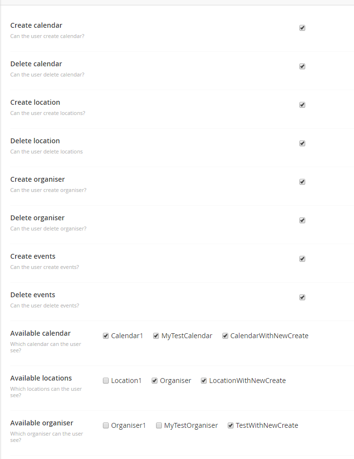

# Security settings

The package provides its own security settings to set which user has access to which calendar and if he can create/edit/delete calendar, locations and organiser. When a user creates a calendar he as automatically all rights for this calendar. The admin user also has access to all entities by default.

## Editing a user
For editing a user select him in the tree or by clicking on the name of the user in the list view.
The admin user settings can only be changed by the admin user for security reasons.

__List view:__

__Tree view:__

After selecting a user you can set different rights for that user and generall access rights on calendar, locations and organiser.

